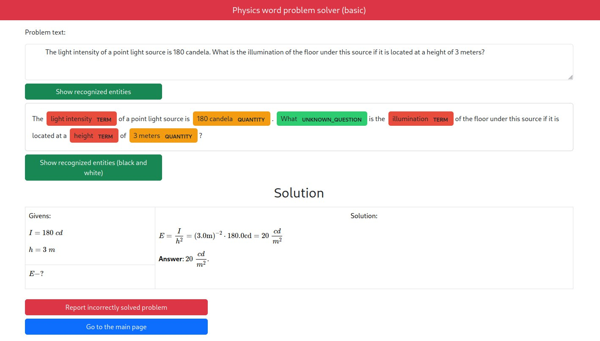

# Physics word problem solver (website part)



AI system that solves physics problems stated in natural language (without LLMs!).

To access, use this website: <https://inanyan.pythonanywhere.com>.

Core library source code: <https://github.com/InAnYan/physics-solver>.

Paper: <https://doi.org/10.15673/atbp.v16i2.2853>.

## Features

To see the features of the AI system, go to <https://github.com/InAnYan/physics-solver-web>.

Here are the features of the website:

- Allows users to send feedback of the system.
- In case a task is wrongly solved, you can report it.
- Provides many examples for testing the project.
- Renders LaTeX.
- Gives access to NER (Named Entity Recognition) results, which allows users to peek inside the system.

## How to Run this Project

```sh
python manage.py runserver
```

*Should Just Work.*

## How this Project is Implemented

Tech stack: Django.

To see core library (AI system) stack and implementation, go to <https://github.com/InAnYan/physics-solver>.

